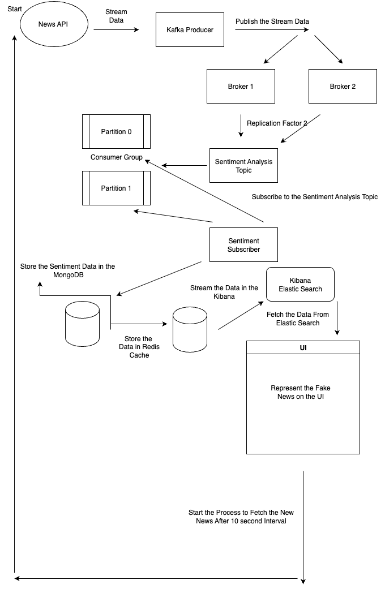

# 📰 Real-Time News Sentiment Analysis Pipeline

A real-time distributed system that ingests breaking news headlines, performs sentiment analysis, stores structured results in **MongoDB**, caches data in **Redis**, logs activity for monitoring in **Elasticsearch + Kibana**, and displays insights through a **Frontend Dashboard**.

---

## 🌐 Overview

This project integrates **Apache Kafka**, **Python**, **MongoDB**, **Redis**, **Elasticsearch**, and a modern **frontend UI** to analyze and visualize sentiment trends in live news streams.

---

## 🧠 Features

- 🔁 Real-time data stream via Kafka
- 🧠 Sentiment analysis with NLP (TextBlob, Transformers, or NLTK)
- 🗂️ Persistent storage in MongoDB
- ⚡ High-speed caching with Redis
- 📊 Centralized logging with Kibana (via Elasticsearch)
- 🖥️ Interactive dashboard (React)

---

## 🏗️ Architecture Diagram




## ⚙️ Project Setup Guide (Using Git Bash)

Follow the steps below to set up and run this project in your local environment using **Git Bash**.

---

### 🛠️ Prerequisites

Make sure the following tools are installed:

- [Git Bash](https://git-scm.com/)
- [Node.js](https://nodejs.org/)
- [Python 3.8+](https://www.python.org/)
- [Docker & Docker Compose](https://www.docker.com/products/docker-desktop)
- [pip](https://pip.pypa.io/en/stable/)
- [npm](https://www.npmjs.com/)

---


### 📥  Run the Service on the Docker Container

```bash
    Start Zookeper Container and expose PORT 2181.

    docker run -p 2181:2181 zookeeper

    Start Kafka Container, expose PORT 9092 Put your IP Address in the Private IP

    docker run -p 9092:9092 \
    -e KAFKA_ZOOKEEPER_CONNECT=<PRIVATE_IP>:2181 \
    -e KAFKA_ADVERTISED_LISTENERS=PLAINTEXT://<PRIVATE_IP>:9092 \
    -e KAFKA_OFFSETS_TOPIC_REPLICATION_FACTOR=1 \
    confluentinc/cp-kafka


```


### 📥 1. Clone the Repository

```bash
git clone https://github.com/SubhamJoshi18/Sentiment-Analysis-Kafka.git
```


### 📥 2. Navigate to the sentiment-analyzer-backend service

```bash
    npm install or npm i
```


### 📥 3. Add the Env Value

```bash
    API_KEY= API Key For the NEWS API
    KAFKA_CLIENT_ID=
    BROKER_URL=
```


### 📥 4. Start the Server

```bash
    npm run start:service
```


### 📥 5. Navigate to the sentiment-model-service

```bash
    pip install -r requirements.txt
```


### 📥 6. Add Env Value For the Model Service

```bash
    GROUP_ID=
    BROKERS=
```

### 📥 7. Run the Model Service

```bash
    python service.py or python3 service.py
```
